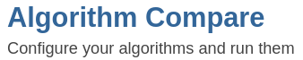
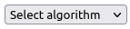
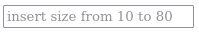
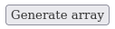
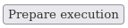
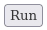
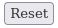

<!-- Improved compatibility of back to top link: See: https://github.com/othneildrew/Best-README-Template/pull/73 -->
<a name="readme-top"></a>
<!--
*** Thanks for checking out the Best-README-Template. If you have a suggestion
*** that would make this better, please fork the repo and create a pull request
*** or simply open an issue with the tag "enhancement".
*** Don't forget to give the project a star!
*** Thanks again! Now go create something AMAZING! :D
-->


<!-- PROJECT SHIELDS -->
<!--
*** I'm using markdown "reference style" links for readability.
*** Reference links are enclosed in brackets [ ] instead of parentheses ( ).
*** See the bottom of this document for the declaration of the reference variables
*** for contributors-url, forks-url, etc. This is an optional, concise syntax you may use.
*** https://www.markdownguide.org/basic-syntax/#reference-style-links
-->
[![Stargazers][stars-shield]][stars-url]
[![MIT License][license-shield]][license-url]
[![LinkedIn][linkedin-shield]][linkedin-url]


<!-- PROJECT LOGO -->
<br />
<div align="center">
  <a href="https://github.com/reddev94/AlgorithmCompare">
    
  </a>

<h3 align="center">Algorithm Compare</h3>

  <p align="center">
    Simple tool to compare different sorting algorithm visual execution
  </p>
</div>


<!-- TABLE OF CONTENTS -->
<details>
  <summary>Table of Contents</summary>
  <ol>
    <li>
      <a href="#about-the-project">About The Project</a>
      <ul>
        <li><a href="#built-with">Built With</a></li>
      </ul>
    </li>
    <li>
      <a href="#getting-started">Getting Started</a>
      <ul>
        <li><a href="#prerequisites">Prerequisites</a></li>
        <li><a href="#installation">Installation</a></li>
      </ul>
    </li>
    <li><a href="#usage">Usage</a></li>
    <li><a href="#license">License</a></li>
    <li><a href="#contact">Contact</a></li>
  </ol>
</details>


<!-- ABOUT THE PROJECT -->
## About The Project
![product-screenshot]

This project aims to be first a demo for the most modern java/spring technologies and for microservice/container architecture, and second a nice idea to graphically visualize and compare the execution of different sorting algorithms. 

Feel free to download it, try it out and take inspiration when you need to implement and use some of the technologies used here.

<p align="right">(<a href="#readme-top">back to top</a>)</p>


### Built With

* Java 20
* Maven 3.9.4
* Angular 11
* Spring boot 3
* Spring technologies: data, aop, webflux, cloud, gateway, eureka, admin, quartz, openapi
* Pf4j
* Mongodb
* Redis
* Docker
* Kubernetes

<p align="right">(<a href="#readme-top">back to top</a>)</p>


<!-- GETTING STARTED -->
## Getting Started

### Prerequisites

The only thing you need is Docker Desktop, that include docker engine and provide you also a nice GUI.
<br>
You can download it, for Linux, Mac and Windows, from the official docker site
  ```sh
  https://www.docker.com/products/docker-desktop/
  ```
And follow the installation guide.

<p align="right">(<a href="#readme-top">back to top</a>)</p>


### Installation

1. Clone the repo
   ```sh
   git clone https://github.com/reddev94/AlgorithmCompare.git
   ```
2. Go to the root repo folder and run this command
   ```sh
   docker-compose up --build
   ```
   This will start the docker image build and container inizialization and will download, inside docker vm, all the necessary things to build and run the app,
   and at the end it will start automatically the containers with the running services.

   N.B: this step can take several minutes, based on your internet speed and PC performance.
   
3. Now in Docker Desktop -> Containers you have a container group "algorithmcompare" with 8 container inside
   - fe -> angular front end app
   - gateway -> spring cloud gateway proxy
   - eureka -> spring eureka service discovery
   - core -> Back end app business logic
   - admin -> spring admin server
   - mongodb -> database for the back end
   - redis -> redis cluster for the backend
   - redis-commander -> the redis commander interface to access redis cluster content
     
Wait until you see 8/8 running container and installation is completed.

<p align="right">(<a href="#readme-top">back to top</a>)</p>


<!-- USAGE EXAMPLES -->
## Usage

To access the app put this address in ypur browser
   ```sh
   http://localhost:8080/AlgorithmCompareHome
   ```
To use the app you have to choose a sorting algorithm from the dropdown menu , choose a size for the array, put in the textbox  and click .<br>
Now you have to click the new appeared button .
At this point you have 2 option:
  1. click  button to launch the sorting algorithm chosen on the array and see the visual execution.
  2. click  to add another visual execution to compare in real time:<br> choose another algorithm from the dropdown menu , click , click .

At the end of the executions, click  button.
<br>
<br>
<br>
Other useful things that you can do:

- Access the spring admin server
   ```sh
   http://localhost:8082
   ```
- Access the eureka service discovery
   ```sh
   http://localhost:8083
   ```
- Access the redis commander interface
   ```sh
   http://localhost:8079
   ```
- Access the mongodb with this connection string
   ```sh
   mongodb://localhost:27017/
   ```
- Access the Back End Core swagger documentation
  ```sh
  http://localhost:8080/swagger-ui/index.html
  ```
- If you have a kubernetes cluster you can deploy the service using the yaml configuration file present in the /k8s folder

<p align="right">(<a href="#readme-top">back to top</a>)</p>


<!-- LICENSE -->
## License

Distributed under the MIT License. See `LICENSE.txt` for more information.

<p align="right">(<a href="#readme-top">back to top</a>)</p>


<!-- CONTACT -->
## Contact

Davide Vennari - [@linkedin](https://www.linkedin.com/in/davide-vennari-805301121) - [@instagram](https://www.instagram.com/reddev_94/) - davide.vennari@gmail.com

Project Link: [https://github.com/reddev94/AlgorithmCompare](https://github.com/reddev94/AlgorithmCompare)

<p align="right">(<a href="#readme-top">back to top</a>)</p>

<!-- MARKDOWN LINKS & IMAGES -->
<!-- https://www.markdownguide.org/basic-syntax/#reference-style-links -->
[stars-shield]: https://img.shields.io/github/stars/reddev94/AlgorithmCompare.svg?style=for-the-badge
[stars-url]: https://github.com/reddev94/AlgorithmCompare/stargazers
[license-shield]: https://img.shields.io/github/license/reddev94/AlgorithmCompare.svg?style=for-the-badge
[license-url]: https://github.com/reddev94/AlgorithmCompare/LICENSE.txt
[linkedin-shield]: https://img.shields.io/badge/-LinkedIn-black.svg?style=for-the-badge&logo=linkedin&colorB=555
[linkedin-url]: https://www.linkedin.com/in/davide-vennari-805301121
[product-screenshot]: images/App2alg.png
[product-dropdown]: images/Dropdown.png
[product-generate-array]: images/Generate_array.png
[product-textbox]: images/Textbox.png
